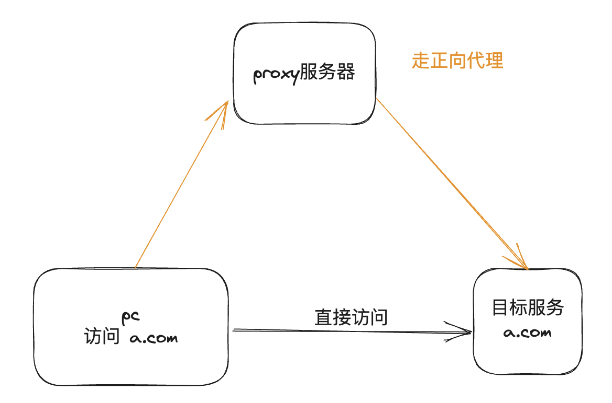
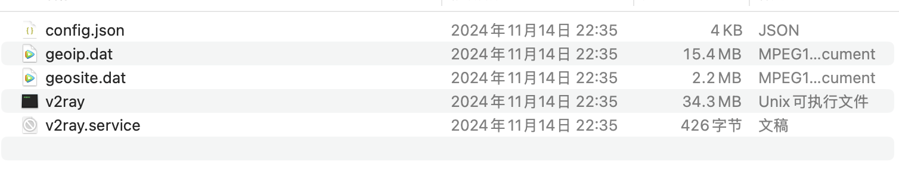
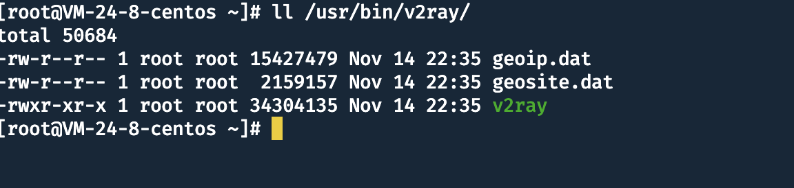
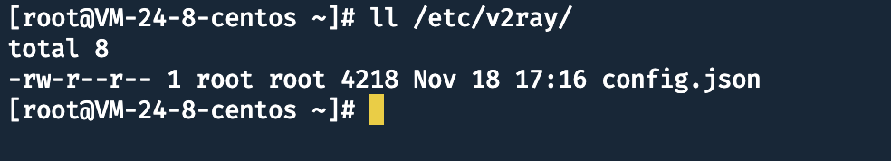
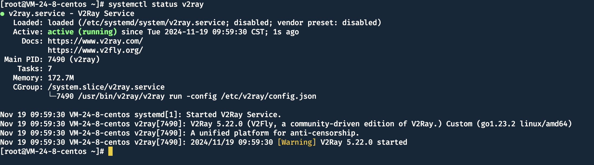
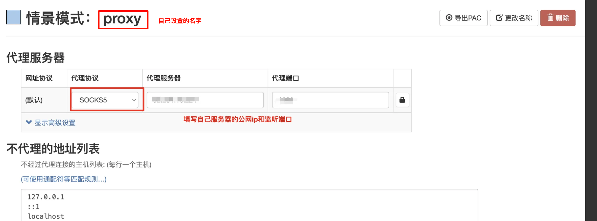
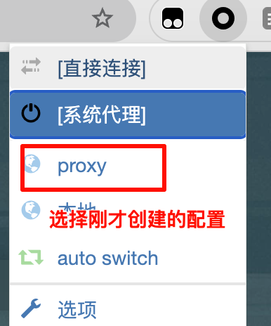
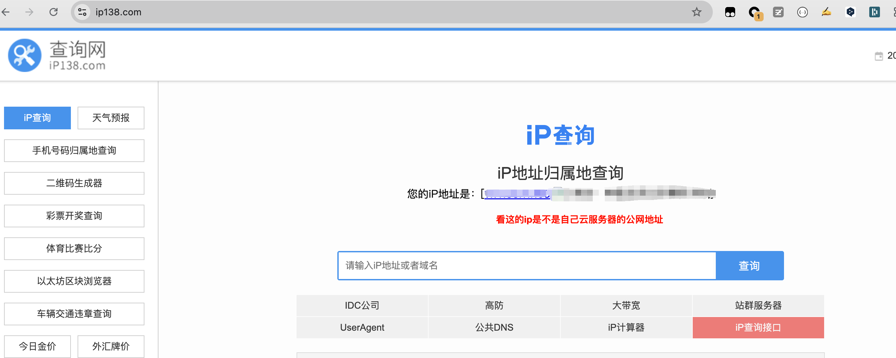

首先什么是正向代理呢？
我们通过代理服务器去访问的目标服务，目标服务看到的源地址是我们的代理服务器地址，而不是我们的真实 ip。

两点好处：

1. 隐藏自己的真实 ip
2. 特定场景下，需要固定公网 ip（一般我们的无线网不是固定的公网 ip，都是在一个地址段随机的地址）



首先需要准备一个云服务器（如果这个服务器能访问外网就可以当梯子用）
然后下载 v2ray，相关的配置我传到网盘中自取（[这儿呢](https://pan.erduoya.top/d/%E5%88%86%E4%BA%AB/%E7%8E%AF%E5%A2%83/v2ray-linux-64.zip?sign=jU7YDHQ2J-eIyLIh-ICjzGZHUTc9TTtSO4BgFo1Mn-U=:1731987151)）

解压以后如下



提前创建文件夹（service文件中指定了目录）,然后将如下四个个文件放到指定目下中

```jsx
mkdir /usr/bin/v2ray
mkdir /etc/v2ray
```





然后将v2ray.service文件放到/etc/systemd/system/目录下

接着刷新，然后启动v2ray服务

```jsx
systemctl daemon-reload
systemctl start v2ray
systemctl status v2ray
```



服务监听的是 1080 口（需要的话自行修改 config.json文件）

<aside>
💡

云服务器别忘了放开防火墙

</aside>

这样正向代理服务器就配置好了，如何使用它呢？

去各大浏览器，找到插件，然后搜索 proxy关键字（找人多的用就行）

安装好插件以后，新建配置，大概是这种界面



保存以后返回到网页，然后点击刚才的插件，选择上一步创建的配置



接下来，通过浏览器访问的页面都会通过我们的云服务器去访问

怎么知道自己成功没？

去访问 [https://ip138.com/](https://ip138.com/)



> 记得如果不用的话就取消浏览器的代理
> 另外自己的服务器代理不用的话就 stop v2ray避免被盗用
