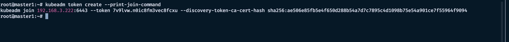
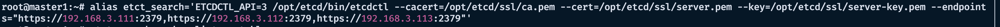
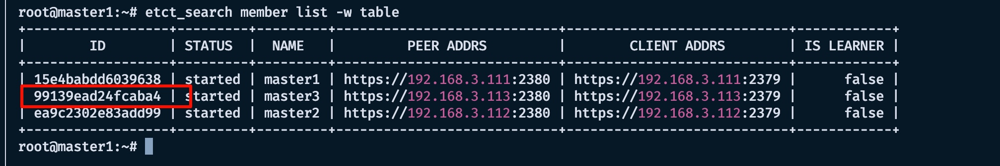
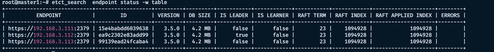

# 一、恢复 k8s集群

一台 master 故障后，需要重新恢复集群，如果原有的机器已经不能使用了，可以重新安装一台，安装所需的环境（参照之前的文章），然后在 master 主机上面获取加入命令

```bash
kubeadm token create --print-join-command
```



获取到命令以后在末尾添加—control-plane，得到master 的加入命令

然后从主上面把证书复制到新的服务器上面(提前改好 hosts 文件)

```bash
scp /etc/kubernetes/pki/ca.*   master3:/etc/kubernetes/pki/
scp /etc/kubernetes/pki/sa.*   master3:/etc/kubernetes/pki/
scp /etc/kubernetes/pki/front-proxy-ca.* master2:/etc/kubernetes/pki/
```

然后在新的服务器上面执行前面获取的 join 命令

```bash
kubeadm join 192.168.3.222:6443 --token 7v9lvw.n0ic8fm3vec8fcxu --discovery-token-ca-cert-hash sha256:ae506e85fb5e4f650d288b54a7d7c7895c4d1098b75e54a901ce7f55964f9094 —control-plane
```

加入完毕后，在 master 主机上面复制 admin.conf文件

```bash
scp /etc/kubernetes/admin.conf master3:/etc/kubernetes/
```

然后在新的服务器上面执行

```bash
mkdir -p $HOME/.kube
sudo cp -i /etc/kubernetes/admin.conf $HOME/.kube/config
sudo chown $(id -u):$(id -g) $HOME/.kube/config
```

k8s集群恢复完毕，接下来恢复 etcd 集群。

# 二、恢复etcd集群

在 master 主机上面移除’坏的‘etcd 节点，需要先获取这个坏的节点的 ID

tips: 可以先给etcd 的命令设置一个别名



```bash
etct_search member list -w table
```



然后移除

```bash
etct_search member remove 99139ead24fcaba4
```

接着从 master 主上面复制 etcd 程序、 etcd 证书etcd 以及服务文件到新的服务器上面

(新的服务器提前创建好/opt/etcd/目录)

```bash
scp -r /opt/etcd/bin/ master3:/opt/etcd/
scp -r /opt/etcd/ssl/ master3:/opt/etcd/
scp /etc/systemd/system/etcd.service master3:/etc/systemd/system/
```

注意etcd.service里面的基本信息需要改成新的服务器的，并且 --initial-cluster-state需要改为 existing;


接着在 maste 主上面加入新的 etcd 节点

```bash
etct_search member add master3 --peer-urls=https://192.168.3.113:2380
```

然后重启所有的 etcd 节点

```bash
systemctl daemon-reload  && systemctl restart etcd
```



这样 etcd 集群恢复完毕。
