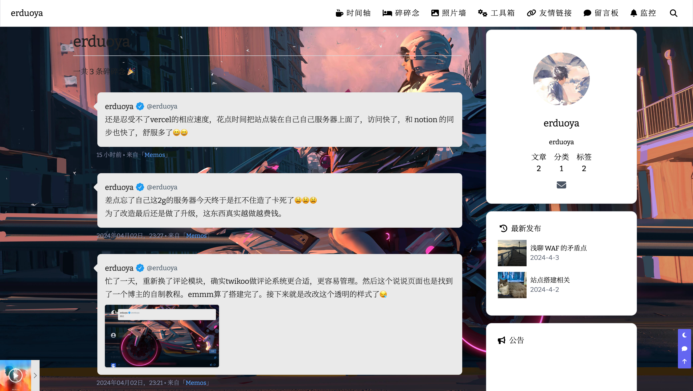
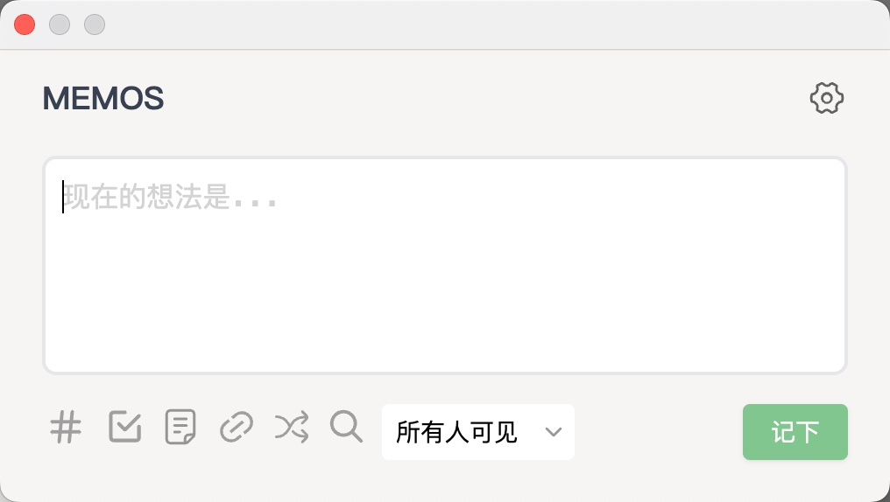
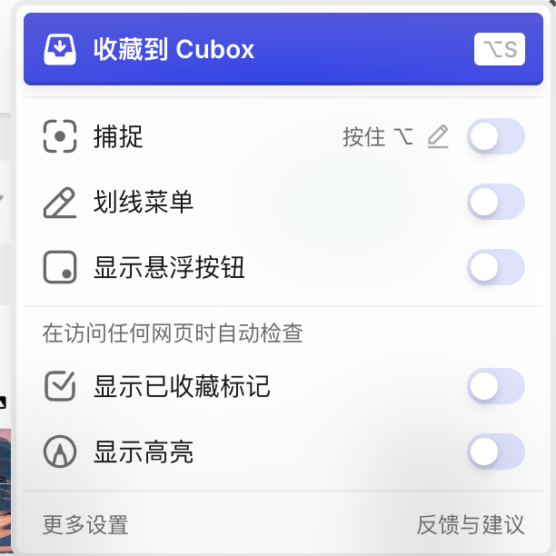
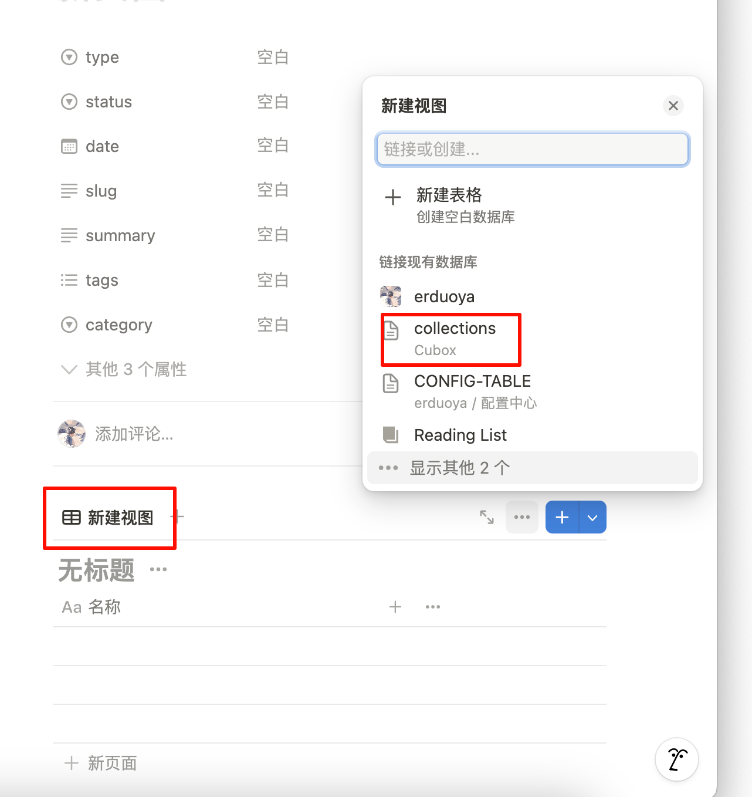
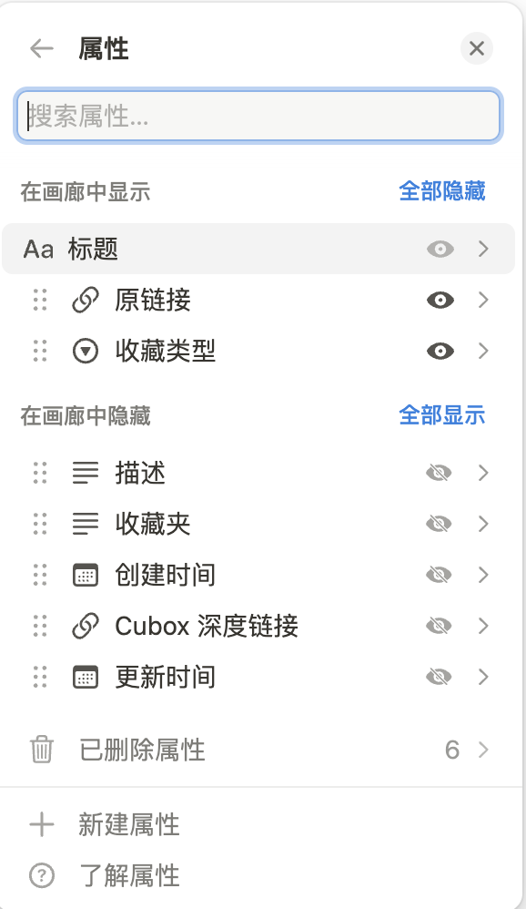
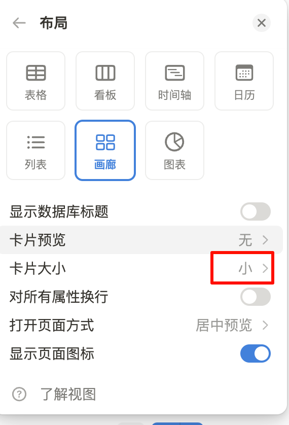
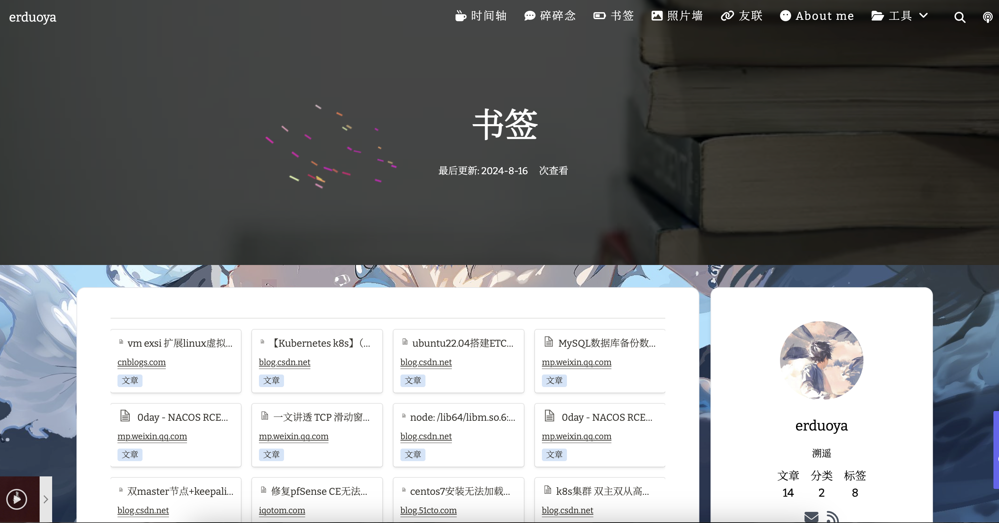

<aside>
💬

破破烂烂、缝缝补补

</aside>

# 博客部分

博客的具体操作步骤看看作者本人的教程吧

[Vercel部署NotionNext | NotionNext BLOG](https://docs.tangly1024.com/article/vercel-deploy-notion-next)

以上是博客站点的搭建过程，适合自己碎碎念。就我目前的体验下缺点我也说说吧，

第一个是国内去访问国外的Vercel真的很慢😣；（挂了梯子会快点）

第二个是notion 更新了内容，再加在到Vercel，再到自己网站访问看到，真的要几分钟，延迟挺高的；

第三个是notion 要想编辑的话，不是蛮方便。不管是作为一个笔记工具还是网站的数据库来讲在国内都是访问挺慢

---

# 网盘

[网盘](https://erduoya.top/)：作为一个打工人，肯定要有些自己的各种常用的软件啥的，之前觉得放在u盘挺好的，但是后面发现有时候如果给其他人种草的话不是很方便，所以想到了用alist来作为网盘去分享一些常用的工具和依赖环境。给别人分享的时候发一下链接即可，自己找也方便。（缺点嘛，服务器带宽太低，下载太慢，怪我‘兜比脸干净’😭😭😭）

[Home](https://alist.nn.ci/)

alist一键安装即可，配合网上的一些美化教程，效果弄的我挺满意的。另外就是之前他强大的挂载功能，之前挂bd网盘的，下载比直接走网盘快多了。可惜最近好像无了。

---

# 第三方工具

站点搭建好了，再来说说用的一些辅助工具（均为免费）：

1.[Uptime Kuma](https://github.com/louislam/uptime-kuma) 开源的监控程序，docker一键安装，页面简洁好看；

2.[onlyoffice](https://github.com/ONLYOFFICE/) 配合alist做doc、ppt、pdf 等文档的在线阅览；

3.[又拍云cdn](https://www.upyun.com/products/cdn) 其实感觉我的站点用cdn好像没啥用 emmm；

4.[safeline](https://waf-ce.chaitin.cn/) 雷池 waf，其实本来我是想找一个能把访问来源地区做成map 的东西，找了下网上的都是国外的一些通过嵌入js做的，速度先不说，那个地图的 ui 真的是劝退我。刚好看到了safeline的统计，看了下还可以。不过入手的是免费的，所以地区统计有些粗糙；作为一个 nginx 去反向代理我的站点和服务，既能起一个防护左右，也能做一个统计。还是值得入手的。缺点嘛就是目前感觉有时候容易cpu占用较高；

5.[路过图床](https://imgse.com) 有一些背景图片本身较大，还是放在图床这样网站会加载快点；

6.[aplayer](https://aplayer.js.org/#/) 简单的js嵌入到网站里面就可以做一个好看的音乐播放器👍；

7.[twikoo](https://github.com/twikoojs/twikoo) 用来做评论系统的，用 mongdb 作为数据库，部署在 vercel 上面；

8.[serverbee](https://serverbee.app/) 监控服务器的，web页面做的挺喜欢的。

---

# “碎碎念“模块

notion 原本只有文章的页面，但是有时候自己的一些小的“唠叨“，页面只是适合大篇幅的文章，随时写也不方便，我就想有个qq 空间或者朋友圈就是这种，能让我随时的发那么一两句话。经过自己大海捞针终于找到了一个”说说模块“的教程。

[NotionNext博客的‘说说’页实现 | 尘世の歌](https://chenge.ink/article/post20240302-1)

博主在 Notionnext 代码中添加了一个页面，用 memos 作为数据来源
将memos用docker一键部署到我的服务器上，响应速度也很快，真的 get 到我的点了。

[GitHub - usememos/memos: An open source, lightweight note-taking service. Easily capture and share your great thoughts.](https://github.com/usememos/memos)

接着自己又找到了谷歌的 [memos插件](https://chromewebstore.google.com/detail/memos/cbhjebjfccgchgbmfbobjmebjjckgofe)，设置好自己的token 以后，直接点一下浏览器插件图标就能在这个地方输入自己的想法然后发布到 memos。

然后自己的说说页面就有了自己的“碎碎念”了。

# 书签模块

平常都是用的浏览器的书签，和账号同步的。我想着博客上面也能有个书签的地方，这样会更加直观的看到自己看了哪些好的帖子。

具体实现是通过[cubox](https://cubox.pro/)来操作的，首先去插件商店里面安装一个 cubox 的插件，配置好以后就是这样，每次有需要收藏的帖子的时候点一下插件图标就收藏好了；

接着需要买一个cubox的会员，通过它的高级功能-同步notion，会自动把你的数据同步至notion；

配置步骤如下

[Notion & Readwise 同步](https://help.cubox.pro/share/integrations/)

然后，新建好一个 menu命名为“书签”，然后指向到一个 page，这个 page 里面添加一个页面，在这个页面里面新建一个画廊视图，选择 collections作为数据源，这样数据就好了；

接下来做一些调整，方便我们在播客页面展示，属性里面展示关键字段；布局里面-卡片大小选择小；

最终效果就是这样了

