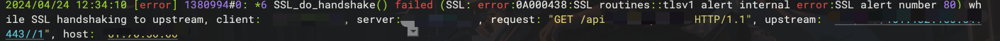

在nginx根据 url 进行反向代理的时候，配置好了 nginx.conf如下

```bash
location /api/ {
        proxy_pass https://xxxxx/;
        proxy_set_header Host xxxxx;
        client_max_body_size 20m;
    }
```

本来配置的也没问题，结果访问 nginx 一直报502，查 nginx 错误日志如下， ssl握手失败了。



[Module ngx_http_proxy_module](https://nginx.org/en/docs/http/ngx_http_proxy_module.html#proxy_ssl_name)

又想到了我源站有 sni 的限制，接着抓包一查，发现在证书协商过程中，nginx 发起的请求果然没有带上 servername


[Nginx https反向代理502错误，proxy_ssl_server_name、proxy_ssl_verify_ssl_do_handshake() failed (ssl: error:14094438:ssl-CSDN博客](https://blog.csdn.net/zzhongcy/article/details/132211707)

最后就是在配置文件再加上这两个参数，这样就会带上 servername 了，访问 nginx 代理也就成功了。

```bash
proxy_ssl_server_name on;
proxy_ssl_name $proxy_host; （可以手动指定，默认是这个）
```


