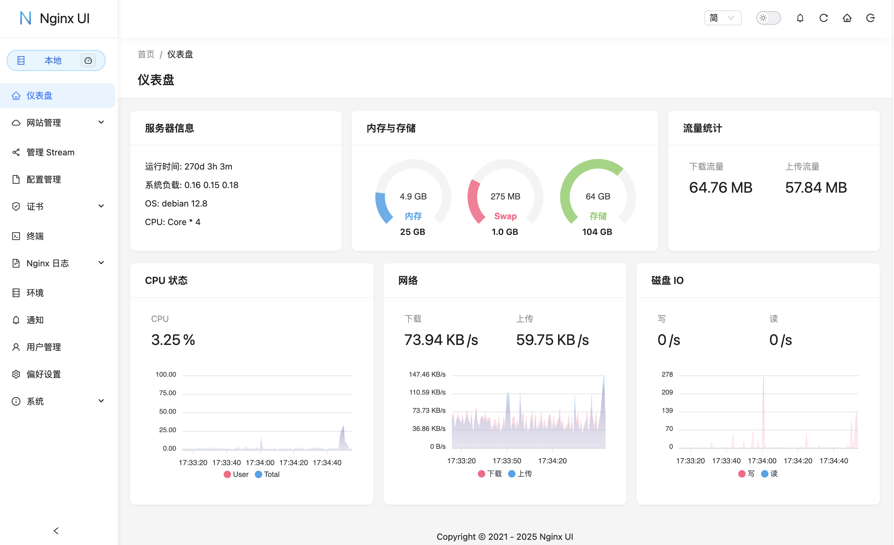

## 一、为什么会想换？

自从昨晚刷到一篇帖子是对 [nginx ui](https://nginxui.com/zh_CN/) 的介绍，开了它的功能界面以后，我当时就想着替换我用了一年多的雷池了。今天花了一天时间，完成了所有的替换。现在静下来分析下为什么做这样一个替换。

首先，本身是做 web 安全这块的产品，所以很早就注意到了雷池，然后就开始在 vps 上面部署了一套免费的。其实大概就是以下几点目的：

- [ ]  体验雷池这款产品；
- [ ]  通过图形化的配置，简化 nginx 的操作；
- [ ]  通过雷池的 waf 功能，给自己的站点增加防护；
- [ ]  通过雷池来来观察自己的站点的一个被访问的情况；

在一年多后的今天，我已经完成了上面几点，但是也出现了新的问题：

- [ ]  证书这块一直都是通过腾讯云免费证书间隔三个月来做不断的更新；
- [ ]  日志分析这块只有一天的范围，想看时间更长或者内容更细的统计，以及在网页实时看nginx 的日志这些都需要购买专业版；
- [ ]  我的站点几乎都是纯前端的，是不用做防护的，而且每天的拦截都是网上的扫描器；
- [ ]  最重要的是雷池对于我这个低配置的云服务器来说，还是有些重了；

而nginx ui 对我来说，页面配置简单、更轻量、能够在页面上实时查看日志、支持证书自动续期、还有对服务器的监控



## 二、从雷池换到 nginx ui的操作

接下来是今天一天的主要的操作内容

1. 首先呢，卸载了原有的雷池，参考命令如下
   （温馨提示，最好提前记录下自己在雷池配置的站点）

   ```bash
   cd /data/safeline
   docker compose down
   rm -rf /data/safeline
   ```
2. 然后开始先安装 nginx

   ```bash
   yum install epel-release
   yum install -y nginx
   systemctl enable nginx
   systemctl start nginx
   ```
3. 安装完了以后需要修改一个配置，/etc/nginx/nginx.conf, 大概39行的位置，添加如下内容

   ```bash
   include /etc/nginx/sites-enabled/*;

   # 添加完了然后刷新nginx
   nginx -s reload

   # 还需要创建两个指定目录
   mkdir  /etc/nginx/sites-enabled
   mkdir /etc/nginx/streams-available
   ```

   
4. 然后安装 nginx ui， 可以参考官方文档。

   [安装脚本 | Nginx UI](https://nginxui.com/zh_CN/guide/install-script-linux.html)

   不想看那么多的可以参考我这个

   ```bash
   # 提前下载这个文件
   https://mirror.ghproxy.com/https://raw.githubusercontent.com/0xJacky/nginx-ui/master/install.sh
   # 然后传到服务器里面去
   chmod -x install.sh
   ./install.sh install
   ```
5. 安装好以后，通过9000端口打开控制台，需要先注册用户。

   
6. 登录好了以后开始配置站点，找到网站管理-添加站点，这里面的指令和 locations 参考原有的 nginx 配置文件，根据下面的提示，指令中的 server_name是必填的。

   

   

   需要注意的是这里面的域名必须是公网域名才能使用第三方托管的证书，当然了也可以自己手动上传证书。

   

## 三、添加goaccess开启实时分析

装好以后有个问题，这个软件没有对 nginx 日志的分析。后来想起了 [goaccess](https://goaccess.io/) ，他是可以解析 nginx 的日志，并且能生成静态报告，还能通过 websocket 做实时的动态刷新。刚好利用这个我可以对 nginx 的日志进行分类统计

```bash
# 安装goaccess
yum install goaccess
# 新建一个目录用来存放报告
mkdir -p /data/www/goaccess/html
# 设置页面为中文（默认是英文）
cd /data/www/goaccess/html
LANG="zh_CN.UTF-8"
# 实时分析的命令，websocket默认监听的是7890口
goaccess /var/log/nginx/access.log -o /data/www/goaccess/html/report.html --log-format=COMBINED --real-time-html  --daemonize
```

运行完了以后，再回到nginx ui，我们新建一个站点，locations可以参考如下定义


这里通过nginx 的 auth 插件来给这个站点添加一个认证功能

```bash
# 安装htpassed工具
yum -y install httpd-tools
# 设置用户名和密码，并把用户名、密码保存到指定文件中
htpasswd -c [passwfile] [username]
#例：htpasswd -c /etc/nginx/passwd you
```

然后回到nginx ui中修改配置


最终效果如下(侧边栏中的绿色点亮了就是 websocket 连接成功)


---

*参考如下：*

[https://www.cnblogs.com/snowdreams1006/p/18319626](https://www.cnblogs.com/snowdreams1006/p/18319626)

[https://trendhu.github.io/2021/02/03/014/](https://trendhu.github.io/2021/02/03/014/)
