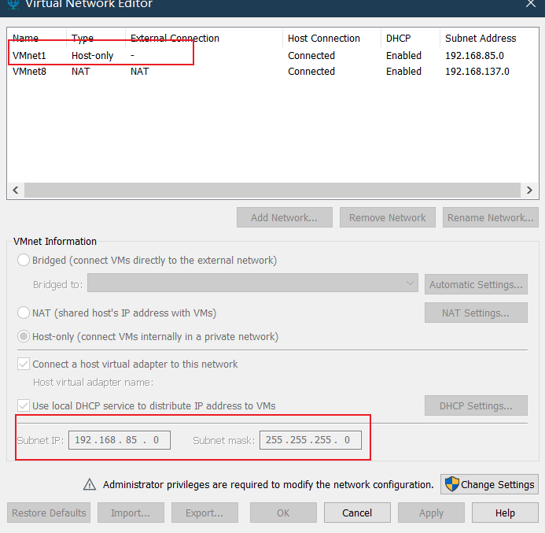

# 一、环境搭建

本次实验环境是从一台 pc1 上面用 vmware 装了一个 pfsense 和一个 server，其中 pfsense 的一块网卡设置为“桥接模式”（保证和另一个 pc2 连接，模拟公网环境），另一块设置为“仅主机连接”（保证和 server 连接，模拟办公网）。server 的网卡也设置为“仅主机连接”。

提前查看这台pc1 的 vmnet1 的 网卡地址范围（vmware 虚拟网络编辑器，vmnet1）,

然后pc1 的网络适配器-vmnet1-ipv4 地址，设置ipv4静态地址192.168.85.2/24
server的 ipv4静态地址是 192.168.85.3/24；（随便装一台服务器即可，由于测试测试环境没有网关，所以可将 pfsense 作为网关）
pfsense 的ipv4静态地址是192.168.85.4/24；

# 二、安装pfsense服务器

1. 登录官网https://www.pfsense.org/download/，下载iso软件包（新版不能直接下载了，附一个2.7.0 版本的[镜像](https://pan.erduoya.top/d/%E5%88%86%E4%BA%AB/%E9%95%9C%E5%83%8F/pfSense-CE-2.7.0-RELEASE-amd64.iso?sign=08DZCRCxunujOidvV6tc2yy5x_o5XPT5Fu3xzpoRdJY=:1725857397)）
2. 通过 vmware 或者 exsi导入 iso 镜像，需要配置两个网卡（一块连接 wan，一块 lan）
   然后开机进入安装；前面的都默认不用选，到了文件格式的地方注意（虚拟机我们选择UFS文件系统格式，如果是物理服务器，且配置有raid阵列卡的我们可以选择ZFS格式安装）

   
3. 安装完成后提示是否需要进入shell模式修改，选择no即可，然后选择reboot重启。

# 二、配置部分

1. 先进行接口配置，选择 1，将 wan 口指向公网的网卡vm0，lan 口指向 vm1；
2. 设置接口地址，选择 2，根据提示分别先先选择 wan 口，然后填写 ipv4 地址、掩码位数、网关地址 （没有可直接回车）；最后再同样的步骤配置一遍 lan 口；

   wan 口设置为 192.168.1.222/24，
   lan 口设置为192.168.85.4/24
3. 设置完成后，打开浏览器去访问 lan 口地址，端口 80就是 pfsense 的 web 管理页面；（默认账密 admin pfsense）

   
4. 进入系统后，首先去System-General Setup, 找到 Language,选择“简体中文”，然后找到上面的 dns，添加 114.114.114.114，最后保存；
5. 在防火墙-规则策略，新建规则，对源和目的都设置 any；

   
6. 在系统-证书-Authoritles，添加，输入一个名字然后保存即可；

   
7. 在系统-证书-证书，添加，输入一个名字，选择所有者，然后保存即可；

   
8. 在VPN-OpenVpn，按照如下配置，添加完成保存即可；

   

   

   

   

   
9. 至此基础配置已经配置完毕，接下来需要用到一个插件，方便我们将 openVpn客户端导出。在系统-插件管理-可用插件，搜索“openvpn-client-export”，安装（插件报错的话可以参考下这个博主的文章）

   [修复pfSense CE无法检索和安装插件的BUG](http://iqotom.com/?p=1978)

   安装完成以后，就能在openvpn 中多出一个 “client export“，设置好主机名即可（用于配置文件的连接vpn 服务器的地址）；

   
10. 配置完成，接下来去创建一个用户和证书。在系统-用户管理-用户，添加用户，填写基本信息，勾选自动创建证书，保存即可；

    
11. 然后去上一步的证书导出的位置，就能看到刚才添加的用户对应的证书；

    
12. 导出以后安装到电脑，然后管理员启动 openvpn，连接这个配置文件，就可以连接上vpn 了；

    

    

> 小问题：连接 vpn 以后，我可以 ping 通 vpn 服务器的内网地址，但是却不通里面的其他服务器；

由于是测试环境，wan 口为私网地址，需要到接口-wan-设置中关闭“阻止私有网络和环回地址”

