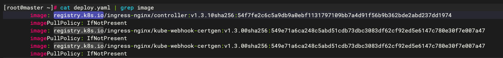

# 一、安装 ingress-nginx

1.下载官方 yaml 文件

```bash
wget https://raw.githubusercontent.com/kubernetes/ingress-nginx/controller-v1.3.1/deploy/static/provider/cloud/deploy.yaml
```

2.换镜像源，将三处镜像源registry.k8s.io换成dockerproxy.com



3.部署 ingress-nginx

```bash
kubectl apply -f deploy.yaml 
```

4. 查一下 ingress-controller 运行的 ip 地址

```bash
kubectl get all -n ingress-nginx -o wide
```


# 二、给 ingree 添加路由访问 nginx服务

1.准备 yaml 文件

> ingressClassName字段的作用？？第一遍没有配置就一直访问不了后端服务，检查过没有进入到 ingress-nginx 的 nginx.conf

```bash
vim nginx1.yaml

apiVersion: networking.k8s.io/v1
kind: Ingress
metadata:
  name: ingress-nginx  #这条规则的名字
spec:
	ingressClassName: nginx
  rules:
  - host: nginx.test.com. # 访问的域名
    http:
      paths:
      - path: /
        pathType: Prefix
        backend:
          service:
            name: nginx-demo #此处的名字和前面创建的nginx的名字要对应
            port: 80
```

2.创建 ingress 规则

```bash
kubectl apply -f nginx.yaml
kubectl get ingress
```


3.通过修改 hosts 文件，将 nginx.test.com指向到10.244.1.18。然后再去 curl 填写的域名就能访问到对应的 nginx


4.也可以修改 ingress 为 nodeport 方式，通过外部去访问。(记得带上外部访问的端口)


