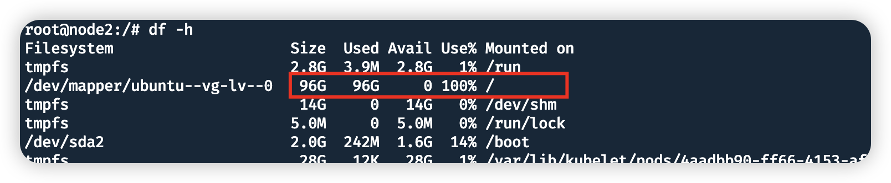

通过 `df -h`命令查看这台机器下面的根目录已经满了

接着去到根目录下面，通过`du -sh  */` 查看具体是哪个目录占用较大

然后进入到/var 目录下面继续通过`du -sh  */`  来查看大文件的目录，最终锁定在一个容器的日志文件下面

确定这个日志文件可以删除后，通过 rm 删除改文件，但是再次查看磁盘空间发现还是并没有变小

接着通过 `lsof -n | grep deleted` 查找出那些已经删除但是继续占用内存空间的文件

确认好以后重启这个 docker容器，磁盘空间恢复正常

