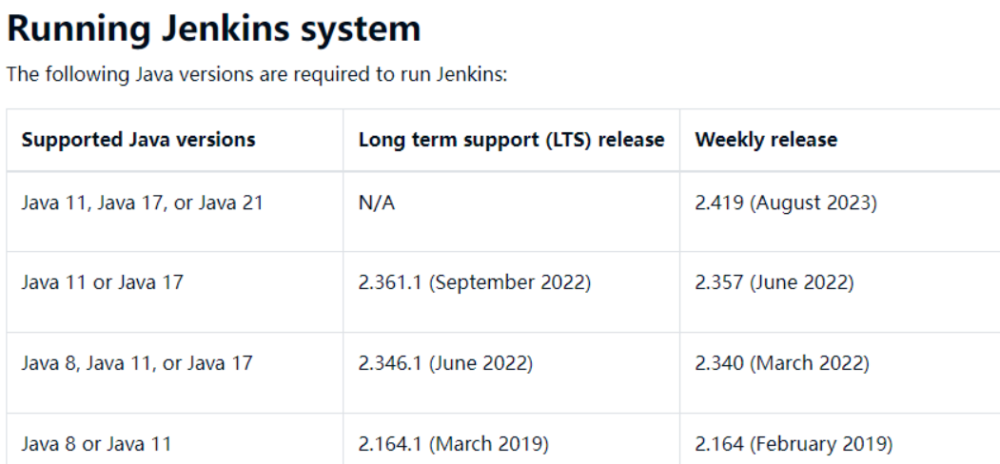
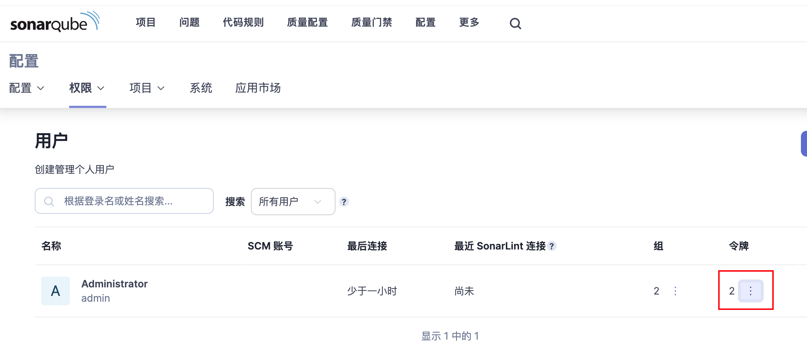

# 1.先吐槽一波

首先这边开发的环境是jdk1.8，所以一开始是想在这台服务器上面直接装一个jenkins，开始直接rpm安装发现安装不了，有版本限制。

然后我特意去查了1.8对应的版本2.361；



安装过程没问题， 但是装完以后发现需要的git插件装不上，提示git需要2.386以上的版本；

接着又查到说这种低版本的不能直接在jenkins里面装插件，需要去官方商店下载hpi包然后倒入，最后结果可想而知，倒入进入还是提示版本jenkins太低导入失败…..

好好好，我妥协了，直接换机器用jdk11开始装jenkins
注意部分，由于开发用的 jdk 是 1.8，所以需要在这个服务器上面装两个 jdk 版本，其中 1.8 作为通过导入profiles 的方式作为全局变量，11版本用于 jenkins 启动；

# 2.正经安装

1.下载rpm包并安装

```jsx
wget https://repo.huaweicloud.com/jenkins/redhat-stable/jenkins-2.452.2-1.1.noarch.rpm
```

2.vim /etc/sysconfig/jenkins，将JENKINS_USER的值改为root，端口默认是8080，可以根据需要进行修改，然后保存；

3.vim /etc/init.d/jenkins，在如下位置添加jdk11的安装位置（可通过执行echo “$JAVA_HOME”获取），添加完然后保存；


4.启动 jenkins

```jsx
	./etc/init.d/jenkins start
```

5.进去以后选择默认，然后配置用户名密码即可；

# 3.配置部分

1.执行 shell 的时间默认是两分钟，如果时间更久，需要点击当前 shell 命令下面的高级，然后修改允许执行时间；


2.如果仓库需要认证，在这个地方进行配置，然后配置任务的时候，填写仓库地址，选择添加的认证；


# 4.插件部分

1.[Localization: Chinese (Simplified)](https://plugins.jenkins.io/localization-zh-cn) 汉化包，可以把 jenkins 的部分内容进行汉化；

2.[List Git Branches Parameter PlugIn](https://plugins.jenkins.io/list-git-branches-parameter) 用来做项目分支管理的，安装好了以后，点击参数化，选择branch，下面的 filter可以配置为refs/heads/(images/Untitled%204.png)


3.[Role-based Authorization Strategy](https://plugins.jenkins.io/role-strategy) 用来做权限管理，精确控制各个模块的读写权限；（新版的 jenkins 中，使用**Manage Roles**需要先将设置为 role-based strategy）


[Jenkins针对不同的项目视图对不同的用户进行权限分配_jenkins视图权限-CSDN博客](https://blog.csdn.net/chj_1224365967/article/details/117924420)

4.[multijob](https://plugins.jenkins.io/jenkins-multijob-plugin) 多任务插件，通过一个父任务来控制多个子任务以及执行顺序和依赖关系；

5.[sonarqube](https://plugins.jenkins.io/sonar/) 配合 sonar 做代码审计，需要从 sonar 里面获取一个 token,然后添加到 jenkins 的用户凭据中，再去系统管理中找到“SonarQube servers”，设置下面的信息。最后去 job 中工作流程中添加“execute sonarqube scanner”，根据项目情况进行填写；




