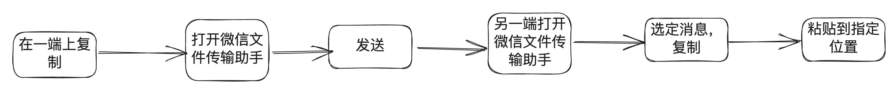
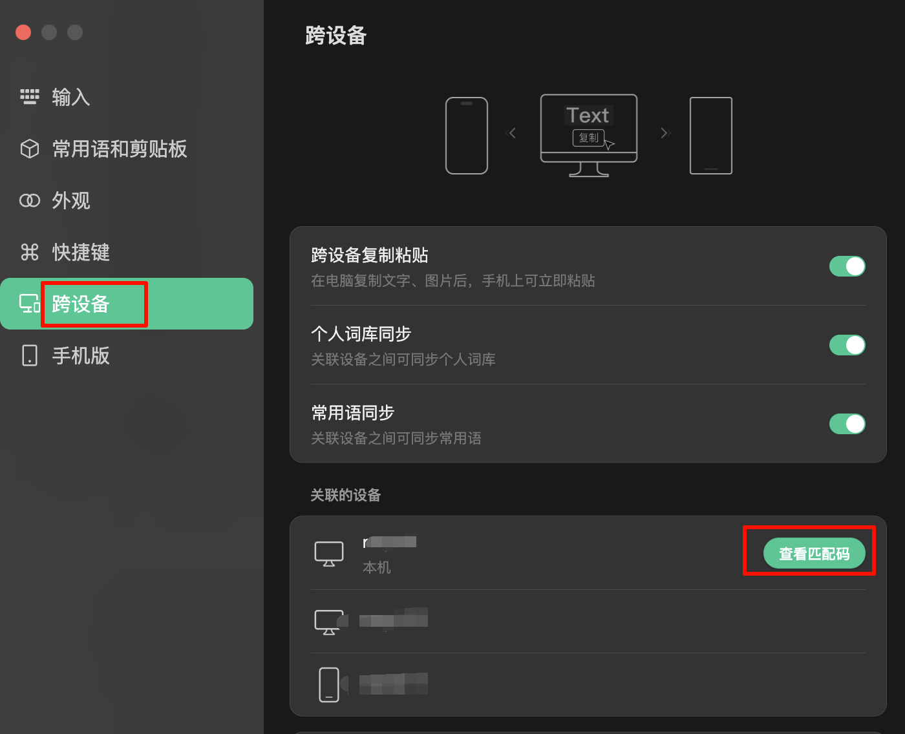
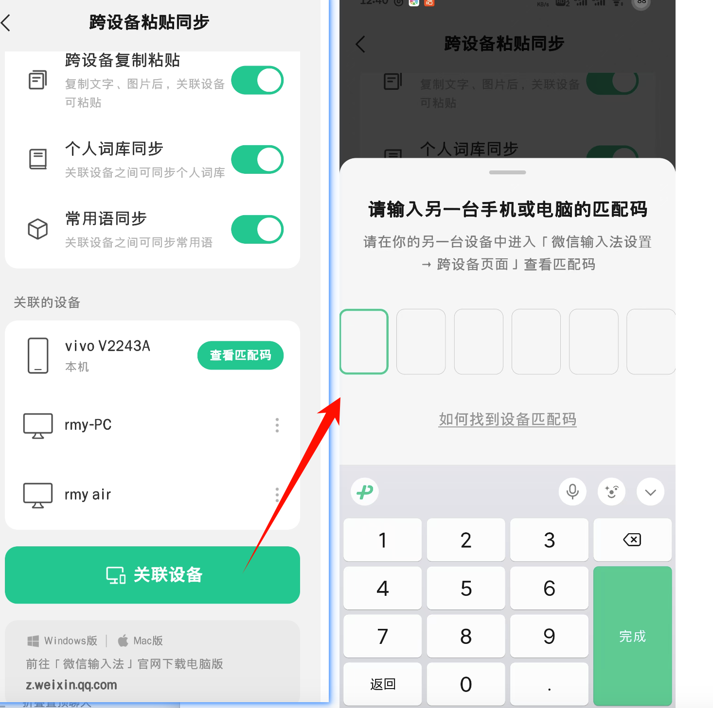
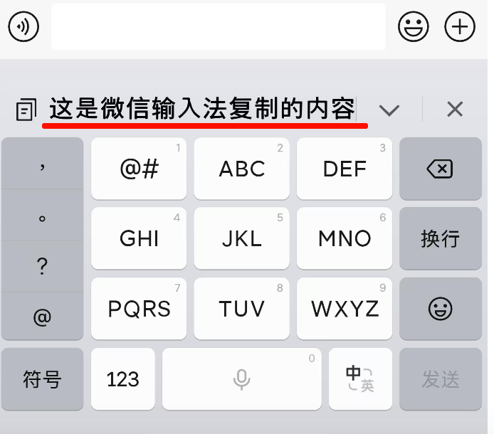

大家经常用电脑的话应该会有一个这样的场景，手机和电脑之间跨设备的将文本、图片进行互传。之前呢我总是用“微信文件传输助手“，这样的话，需要大致要经过以下 6 个步骤

有没有觉得很麻烦呢？其实我们想做的事情只有复制+粘贴两步而已

这么麻烦显然不是我们想要的，那如何将上面 6 步变成两步呢？
[**微信输入法**](https://z.weixin.qq.com/)

具体步骤很简单

1. 首先呢，我们在电脑和手机上分别上安装微信文件输入法，并设置为默认输入法
2. 接着查看在电脑的微信输入法设置中，找到“跨设备”，然后查看匹配码

   
3. 然后到手机上的微信输入法设置中，找到“关联设备”，输入上一步获取的匹配码

   
4. 配对完成后，接下来只需要将文本或者图片进行复制，另一个设备上就可以直接进行粘贴了

   

---

*补充一点，希望手机的厂家提一个小建议，给手机截图增加一个自动复制到剪贴板的功能。
有时候我们需要把手机上的内容进行截图，然后分享给其他人或者自己的电脑的场景
我们需要截图先截图，然后去对应的微信或者其他聊天的 app 里面，选择图片发送（有些 app 比如微信会有 一个快捷预览点击就能发送）
这样其实也是有三步的，但是如果截图以后自动能自动复制到剪贴板，那么就能直接简化一步
不管最终的需要粘贴的位置是手机 app 或者电脑，都只需要去到对应的位置然后粘贴就好了。*
