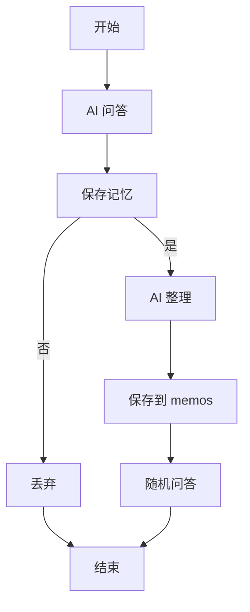
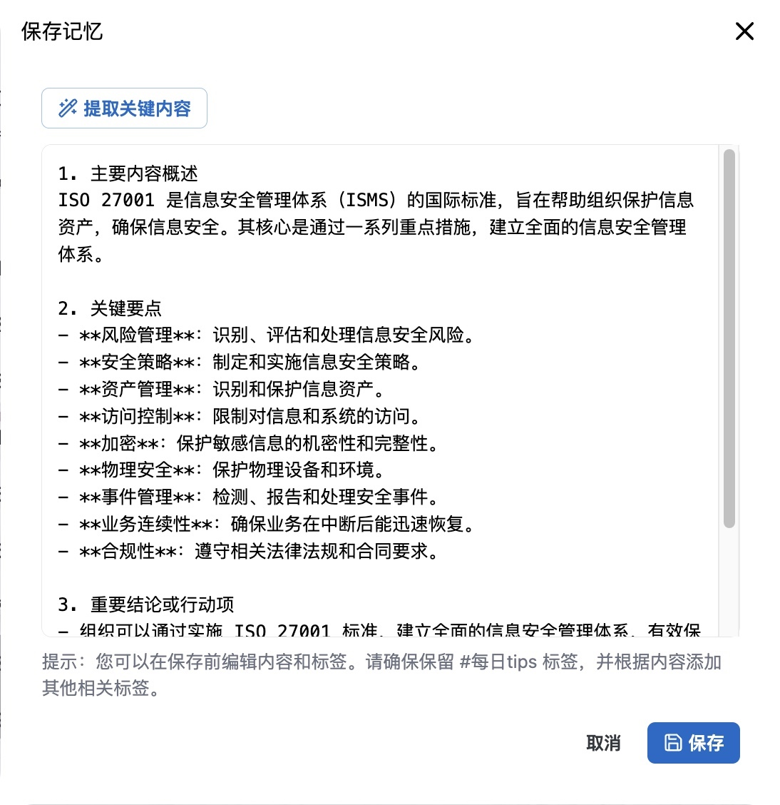

最近发现一个问题，自从 AI 工具上线以后，自己几乎每天会问它们很多问题，但是呢最后自己并没有记住这些问题和解决的办法。

# 解决方案

看了博主的[介绍视频](https://www.bilibili.com/video/BV1Au4y147Nn?spm_id_from=333.788.videopod.sections) 想着说在 memos 的基础上来做改造；

## 整体流程

整体的流程如下

# 开发过程

另外需要提的是，在整个改造过程中，我是用`cursor`来完成整个前端的改造，它能去读取整个项目，更快更准的找到位置来做代码开发，效果真的很惊艳。我可以是一个对 React 零基础的小白，只需要和讲清楚我的需求，它能完全代替我去做开发，思考速度很快，我最后仅仅是做一个确认。最后做出来的效果也远超我的预期。

