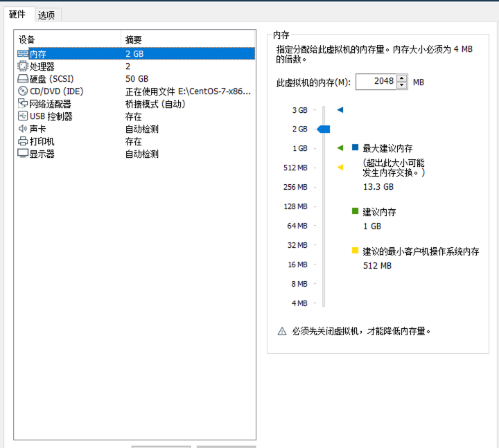

# 一、 准备工作

1.在自己电脑上用 vmware 安装三台2 核2g，硬盘 50g 的服务器（ 本文用的镜像是 centos7.6），配置好三个静态 ip；具体操作过程见[菜鸟教程](https://www.runoob.com/w3cnote/vmware-install-centos7.html)，操作完成后都拍摄一个快照（别问我为什么）



2.安装好了以后ssh 连接上三台服务器，开启同步输入；


3.设置 hosts（注意 ip地址改成自己三台服务器的地址）

```bash
sudo vi /etc/hosts

192.168.1.200 master
192.168.1.201 node1
192.168.1.202 node2
```

4.时间同步

```bash
#启动chronyd服务
systemctl start chronyd
systemctl enable chronyd
```

5.关闭firewalld服务

```bash
systemctl stop firewalld
systemctl disable firewalld
```

6.关闭selinux服务（

```bash
sed -i 's/enforcing/disabled/' /etc/selinux/config 
```

7.禁用swap分区

> Tips：swap分区指的是虚拟内存分区，它的作用是物理内存使用完，之后将磁盘空间虚拟成内存来使用，启用swap设备会对系统的性能产生非常负面的影响，因此kubernetes要求每个节点都要禁用swap设备，但是如果因为某些原因确实不能关闭swap分区，就需要在集群安装过程中通过明确的参数进行配置说明

编辑分区配置文件/etc/fstab，注释掉swap分区一行（注意修改完毕之后需要重启linux服务）

```bash
vi /etc/fstab
#注释掉下面的设置
/dev/mapper/centos-swap swap
```


8.重启三台服务器,然后保存一个快照。

# 二、安装 docker

1.首先，确保系统包已更新；（以下步骤可以继续用同步输入）

```bash
sudo yum update -y

yum -y install yum-utils

yum-config-manager --add-repo http://mirrors.aliyun.com/docker-ce/linux/centos/docker-ce.repo
```

2.Kubernetes 需要 Docker 运行容器。您可以使用以下命令安装 Docker：

```bash
#安装 docker 依赖包
sudo yum install -y yum-utils device-mapper-persistent-data lvm2
sudo yum install -y docker-ce docker-ce-cli containerd.io
sudo systemctl start docker
sudo systemctl enable docker
```

#设置docker镜像源文件

```bash
sudo touch /etc/docker/daemon.json
```

更新 docker镜像源,

```bash
vi /etc/docker/daemon.json
```

```bash
{
   "registry-mirrors": ["https://mirror.ccs.tencentyun.com"],
   "exec-opts": ["native.cgroupdriver=systemd"]
}
```

重启 docker

```bash
sudo systemctl daemon-reload
sudo systemctl restart docker
sudo systemctl status docker
```


# 三、配置Kubernetes

1.配置 Kubernetes 存储库

要安装 Kubernetes 组件，您需要将 Kubernetes 存储库添加到系统。

```bash
vi /etc/yum.repos.d/kubernetes.repo
```

```bash
[kuberneten]
name=Kubernetes
baseurl=https://mirrors.aliyun.com/kubernetes/yum/repos/kubernetes-el7-x86_64
enabled=1
gpgcheck=0
repo_gpgcheck=0
gpgkey=https://mirrors.aliyun.com/kubernetes/yum/doc/yum-key.gpg
<https://mirrors.aliyun.com/kubernetes/yum/doc/rpm-package-key.gpg>
```

2.安装 kubelet、kubeadm 和 kubectl

```bash
yum install -y kubelet-1.23.0 kubeadm-1.23.0 kubectl-1.23.0
```

3.设置kubelet开机启动

```bash
 systemctl enable kubelet
 systemctl start kubelet
```

4.在master 上面执行(红色部分地址改成 master的地址)

```bash
kubeadm init   --apiserver-advertise-address=192.168.1.200   --image-repository registry.aliyuncs.com/google_containers   --kubernetes-version v1.23.0   --service-cidr=10.96.0.0/12   --pod-network-cidr=10.244.0.0/16   --ignore-preflight-errors=all
```


5.复制上一步骤红框中的内容，然后在node节点执行


6.将master中的【/etc/kubernetes/admin.conf】文件拷贝到从节点相同目录下

> “The connection to the server localhost:8080 was refused - did you specify the right host or port?”
> kubectl命令需要使用kubernetes-admin来运行，解决方法如下，将主节点中的【/etc/kubernetes/admin.conf】文件拷贝到从节点相同目录下，然后配置环境变量

```bash
scp /etc/kubernetes/admin.conf 192.168.1.201:/etc/kubernetes/
scp /etc/kubernetes/admin.conf 192.168.1.202:/etc/kubernetes/
```

然后三台设备执行

```bash
mkdir -p $HOME/.kube
sudo cp -i /etc/kubernetes/admin.conf $HOME/.kube/config
sudo chown $(id -u):$(id -g) $HOME/.kube/config
```

node节点配置环境变量：

```bash
echo "export KUBECONFIG=/etc/kubernetes/admin.conf" >> ~/.bash_profile
source ~/.bash_profile
```

7.master**安装cni网络插件flannel**

```bash
# 下载flannel插件的yml(没有 wget可以用 yum 安装)
wget https://raw.githubusercontent.com/coreos/flannel/master/Documentation/kube-flannel.yml

# 修改kube-flannel.yml中的镜像仓库地址为国内源
sed -i 's/quay.io/quay-mirror.qiniu.com/g' kube-flannel.yml

# 安装网络插件
kubectl apply -f kube-flannel.yml
```


8.检查节点状态

```bash
kubectl get node
```


至此 k8s集群安装完毕！

# 四、补充

1.yaml 文件字段解释


| 参数名                                      | 类型    | 字段说明                                                                                                                                                                                                                                                                                                                                                                  |
| ------------------------------------------- | ------- | ------------------------------------------------------------------------------------------------------------------------------------------------------------------------------------------------------------------------------------------------------------------------------------------------------------------------------------------------------------------------- |
| apiVersion                                  | String  | K8S APl 的版本，可以用 kubectl api versions 命令查询                                                                                                                                                                                                                                                                                                                      |
| kind                                        | String  | yam 文件定义的资源类型和角色                                                                                                                                                                                                                                                                                                                                              |
| metadata                                    | Object  | 元数据对象，下面是它的属性                                                                                                                                                                                                                                                                                                                                                |
| [metadata.name](http://metadata.name/)      | String  | 元数据对象的名字，比如 pod 的名字                                                                                                                                                                                                                                                                                                                                         |
| metadata.namespace                          | String  | 元数据对象的命名空间                                                                                                                                                                                                                                                                                                                                                      |
| Spec                                        | Object  | 详细定义对象                                                                                                                                                                                                                                                                                                                                                              |
| spec.containers[]                           | list    | 定义 Spec 对象的容器列表                                                                                                                                                                                                                                                                                                                                                  |
| spec.containers[].name                      | String  | 为列表中的某个容器定义名称                                                                                                                                                                                                                                                                                                                                                |
| spec.containers[].image                     | String  | 为列表中的某个容器定义需要的镜像名称                                                                                                                                                                                                                                                                                                                                      |
| spec.containers[].imagePullPolicy           | string  | 定义镜像拉取策略，有 Always、Never、IfNotPresent 三个值可选<br />  - Always（默认）：意思是每次都尝试重新拉取镜像<br />  - Never：表示仅适用本地镜像<br />  - IfNotPresent：如果本地有镜像就使用本地镜像，没有就拉取在线镜像。                                                                                                                                            |
| spec.containers[].command[]                 | list    | 指定容器启动命令，因为是数组可以指定多个，不指定则使用镜像打包时使用的启动命令。                                                                                                                                                                                                                                                                                          |
| spec.containers[].args[]                    | list    | 指定容器启动命令参数，因为是数组可以指定多个。                                                                                                                                                                                                                                                                                                                            |
| spec.containers[].workingDir                | string  | 指定容器的工作目录                                                                                                                                                                                                                                                                                                                                                        |
| spec.containers[].volumeMounts[]            | list    | 指定容器内部的存储卷配置                                                                                                                                                                                                                                                                                                                                                  |
| spec.containers[].volumeMounts[].name       | string  | 指定可以被容器挂载的存储卷的名称                                                                                                                                                                                                                                                                                                                                          |
| spec.containers[].volumeMounts[].mountPath  | string  | 指定可以被容器挂载的存储卷的路径                                                                                                                                                                                                                                                                                                                                          |
| spec.containers[].volumeMounts[].readOnly   | string  | 设置存储卷路径的读写模式，ture 或者 false，默认是读写模式                                                                                                                                                                                                                                                                                                                 |
| spec.containers[].ports[]                   | list    | 指定容器需要用到的端口列表                                                                                                                                                                                                                                                                                                                                                |
| spec.containers[].ports[].name              | string  | 指定端口的名称                                                                                                                                                                                                                                                                                                                                                            |
| spec.containers[].ports[].containerPort     | string  | 指定容器需要监听的端口号                                                                                                                                                                                                                                                                                                                                                  |
| spec.containers[].ports[].hostPort          | string  | 指定容器所在主机需要监听的端口号，默认跟上面 containerPort 相同，注意设置了 hostPort 同一台主机无法启动该容器的相同副本（因为主机的端口号不能相同，这样会冲突）                                                                                                                                                                                                           |
| spec.containers[].ports[].protocol          | string  | 指定端口协议，支持 TCP 和 UDP，默认值为 TCP                                                                                                                                                                                                                                                                                                                               |
| spec.containers[].env[]                     | list    | 指定容器运行前需设置的环境变量列表                                                                                                                                                                                                                                                                                                                                        |
| spec.containers[].env[].name                | string  | 指定环境变量名称                                                                                                                                                                                                                                                                                                                                                          |
| spec.containers[].env[].value               | string  | 指定环境变量值                                                                                                                                                                                                                                                                                                                                                            |
| spec.containers[].resources                 | Object  | 指定资源限制和资源请求的值（这里开始就是设置容器的资源上限）                                                                                                                                                                                                                                                                                                              |
| spec.containers[].resources.limits          | Object  | 指定设置容器运行时资源的运行上限                                                                                                                                                                                                                                                                                                                                          |
| spec.containers[].resources.limits.cpu      | string  | 指定 CPU 的限制，单位为 Core 数，将用于 docker run –cpu-shares 参数                                                                                                                                                                                                                                                                                                      |
| spec.containers[].resources.limits.memory   | string  | 指定 mem 内存的限制，单位为 MIB、GiB                                                                                                                                                                                                                                                                                                                                      |
| spec.containers[].resources.requests        | Object  | 指定容器启动和调度时的限制设置                                                                                                                                                                                                                                                                                                                                            |
| spec.containers[].resources.requests.cpu    | string  | CPU请求，单位为core数，容器启动时初始化可用数量                                                                                                                                                                                                                                                                                                                           |
| spec.containers[].resources.requests.memory | string  | 内存请求，单位为MIB、GiB，容器启动的初始化可用数量                                                                                                                                                                                                                                                                                                                        |
| spec.restartPolicy                          | string  | 定义 pod 的重启策略，可选值为 Always、OnFailure、Never，默认值为 Always。<br />  - Always：pod 一旦终止运行，则无论容器是如何终止的，kubelet 服务都将重启它。<br />  - OnFailure：只有 pod 以非零退出码终止时，kubelet 才会重启该容器。如果容器正常结束（退出码为0），则 kubectl 将不会重启它。<br />  - Never：Pod 终止后，kubelet 将退出码报告给 master，不会重启该 pod |
| spec.nodeSelector                           | Object  | 定义 Node 的 label 过滤标签，以 key：value 格式指定                                                                                                                                                                                                                                                                                                                       |
| spec.imagePullSecrets                       | Object  | 定义 pull 镜像时使用 secret 名称，以 name：secretkey 格式指定                                                                                                                                                                                                                                                                                                             |
| spec.hostNetwork                            | Boolean | 定义是否使用主机网络模式，默认值为 false。设置 true 表示使用宿主机网络，不使用 docker 网桥，同时设置了 true将无法在同一台宿主机上启动第二个副本                                                                                                                                                                                                                           |

2.资源类型别名对照表


| 资源类型                   | 缩写别名 |
| -------------------------- | -------- |
| `clusters`                 |          |
| `componentstatuses`        | `cs`     |
| `configmaps`               | `cm`     |
| `daemonsets`               | `ds`     |
| `deployments`              | `deploy` |
| `endpoints`                | `ep`     |
| `event`                    | `ev`     |
| `horizontalpodautoscalers` | `hpa`    |
| `ingresses`                | `ing`    |
| `jobs`                     |          |
| `limitranges`              | `limits` |
| `namespaces`               | `ns`     |
| `networkpolicies`          |          |
| `nodes`                    | `no`     |
| `statefulsets`             |          |
| `persistentvolumeclaims`   | `pvc`    |
| `persistentvolumes`        | `pv`     |
| `pods`                     | `po`     |
| `podsecuritypolicies`      | `psp`    |
| `podtemplates`             |          |
| `replicasets`              | `rs`     |
| `replicationcontrollers`   | `rc`     |
| `resourcequotas`           | `quota`  |
| `cronjob`                  |          |
| `secrets`                  |          |
| `serviceaccount`           | `sa`     |
| `services`                 | `svc`    |
| `storageclasses`           |          |
| `thirdpartyresources`      |          |
