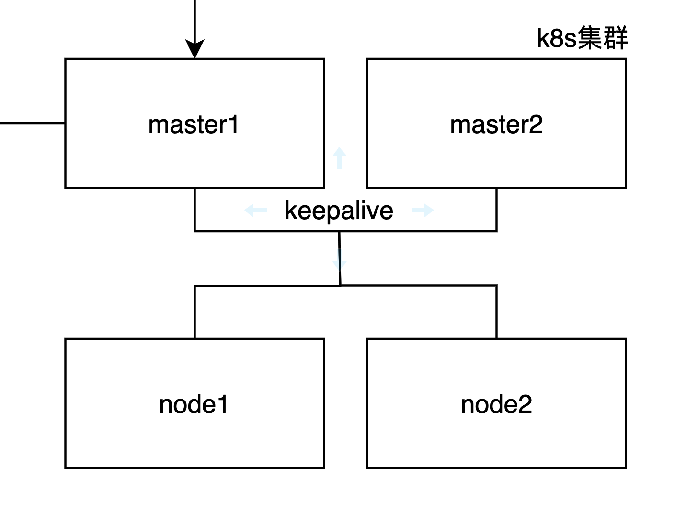

为了增加稳定性，在原有 k8s集群的基础上，增加一个 master 节点，然后在 master1 和 master2 之间做 keepalive，通过 vip 去访问业务；


## 安装步骤

1.尝试离线环境部署，所以先在本地有网的环境创建一个低配置的乌班图 22.04 版本的虚机，然后安装好基础环境（通过 apt-get安装好 docker、各种依赖镜像和k8s，keepalive），不要初始化kubeadm！(可以参考下文前面的部分)

[【Ubuntu22.04配置k8s集群】_ubunut 22.04 chronyd-CSDN博客](https://blog.csdn.net/goislaji/article/details/140378001)

2.然后关机导出 vmdk 镜像上传至生产环境；接下来在生产环境导入这个镜像，创建 4 个虚机；

3.重新修改网卡配置后，修改 host 文件和主机名

```jsx
172.28.0.34 master1
172.28.0.35 master2
172.28.0.36 node1
172.28.0.37 node2
```

```jsx
hostnamectl set-hostname xxxx
```

修改 keepalive.yaml文件配置，改为 vip 地址（172.28.0.39）

```jsx
vim /etc/keepalived/keepalived.conf

vrrp_instance VI_1 {
    state MASTER
    interface ens160
    virtual_router_id 51
    priority 100    # 优先级 (主服务器优先级高)
    advert_int 1    # 心跳间隔 (秒)
    authentication {
        auth_type PASS
        auth_pass 1111
    }
    virtual_ipaddress {
        172.28.0.39 # 虚拟IP
 }
   
}
```

修改 docker 仓库地址为 harbor 仓库地址地址，然后进行 docker login 认证

```jsx
vim /etc/docker/daemon.json

{"registry-mirrors": ["harbor仓库地址"]}
```

> 1. 仓库地址如果是 http 的，需要daemon.json，把registry-mirrors改成insecure-registries修改允许 http请求；
>    2.docker 登录完以后需要将/root/.docker/config.json 复制到/var/lib/kebelet/config.json，让 k8s集群中也有 docker 的登录授权信息；

4.创建kubeadm.yaml（注意修改地址）

```jsx
apiVersion: kubeadm.k8s.io/v1beta3
bootstrapTokens:
- groups:
  - system:bootstrappers:kubeadm:default-node-token
  token: abcdef.0123456789abcdef
  ttl: 24h0m0s
  usages:
  - signing
  - authentication
kind: InitConfiguration
localAPIEndpoint:
  advertiseAddress: 172.28.0.38
  bindPort: 6443
nodeRegistration:
  criSocket: /var/run/dockershim.sock
  imagePullPolicy: IfNotPresent
  name: node
  taints: null
---
apiServer:
  timeoutForControlPlane: 4m0s
apiVersion: kubeadm.k8s.io/v1beta3
certificatesDir: /etc/kubernetes/pki
clusterName: kubernetes
controllerManager: {}
dns: {}
etcd: #etcd集群
  local:
    dataDir: /var/lib/etcd
imageRepository: registry.cn-hangzhou.aliyuncs.com/google_containers
kind: ClusterConfiguration
kubernetesVersion: 1.23.0
controlPlaneEndpoint: 172.28.0.38:6443  
apiServer:                       
  certSANs: #填写vip地址、maste1和maste2地址                      
  - 172.28.0.38         
  - 172.28.0.34
  - 172.28.0.35
networking:
  dnsDomain: cluster.local
  serviceSubnet: 10.96.0.0/12
  podSubnet: 10.2.0.0/16
scheduler: {}

---                                     
apiVersion: kubeproxy.config.k8s.io/v1alpha1   
kind: KubeProxyConfiguration             
mode: ipvs
```

5.在 master1 上执行初始化命令

```jsx
kubeadm init --config kubeadm.yaml
```


> 重新获取join命令 kubeadm token create --print-join-command

6.需要将 master1 上面的证书复制到 master2

```jsx
# 先在 master 上创建相关文件夹
mkdir -p /etc/kubernetes/pki/etcd/

在master1上执行，将master1的证书拷贝到master2
scp /etc/kubernetes/pki/ca.*   master2:/etc/kubernetes/pki/
scp /etc/kubernetes/pki/sa.*   master2:/etc/kubernetes/pki/
scp /etc/kubernetes/pki/front-proxy-ca.* master2:/etc/kubernetes/pki/
scp /etc/kubernetes/pki/etcd/ca.* master2:/etc/kubernetes/pki/etcd/
```

7.将上面的join命令分别在 master2 、node1和 node2 上面执行

8.将master1的 admin.conf复制到其他三台设备

```jsx
scp /etc/kubernetes/admin.conf master2:/etc/kubernetes/
scp /etc/kubernetes/admin.conf node1:/etc/kubernetes/
scp /etc/kubernetes/admin.conf node2:/etc/kubernetes/

#然后四台设备上执行
mkdir -p $HOME/.kube
sudo cp -i /etc/kubernetes/admin.conf $HOME/.kube/config
sudo chown $(id -u):$(id -g) $HOME/.kube/config
```

9.安装网络插件flannel

```jsx
vim flannel.yaml
```

```jsx
---
kind: Namespace
apiVersion: v1
metadata:
  name: kube-flannel
  labels:
    k8s-app: flannel
    pod-security.kubernetes.io/enforce: privileged
---
kind: ClusterRole
apiVersion: rbac.authorization.k8s.io/v1
metadata:
  labels:
    k8s-app: flannel
  name: flannel
rules:
- apiGroups:
  - ""
  resources:
  - pods
  verbs:
  - get
- apiGroups:
  - ""
  resources:
  - nodes
  verbs:
  - get
  - list
  - watch
- apiGroups:
  - ""
  resources:
  - nodes/status
  verbs:
  - patch
---
kind: ClusterRoleBinding
apiVersion: rbac.authorization.k8s.io/v1
metadata:
  labels:
    k8s-app: flannel
  name: flannel
roleRef:
  apiGroup: rbac.authorization.k8s.io
  kind: ClusterRole
  name: flannel
subjects:
- kind: ServiceAccount
  name: flannel
  namespace: kube-flannel
---
apiVersion: v1
kind: ServiceAccount
metadata:
  labels:
    k8s-app: flannel
  name: flannel
  namespace: kube-flannel
---
kind: ConfigMap
apiVersion: v1
metadata:
  name: kube-flannel-cfg
  namespace: kube-flannel
  labels:
    tier: node
    k8s-app: flannel
    app: flannel
data:
  cni-conf.json: |
    {
      "name": "cbr0",
      "cniVersion": "0.3.1",
      "plugins": [
        {
          "type": "flannel",
          "delegate": {
            "hairpinMode": true,
            "isDefaultGateway": true
          }
        },
        {
          "type": "portmap",
          "capabilities": {
            "portMappings": true
          }
        }
      ]
    }
  net-conf.json: |
    {
      "Network": "10.2.0.0/16",
      "EnableNFTables": false,
      "Backend": {
        "Type": "vxlan"
      }
    }
---
apiVersion: apps/v1
kind: DaemonSet
metadata:
  name: kube-flannel-ds
  namespace: kube-flannel
  labels:
    tier: node
    app: flannel
    k8s-app: flannel
spec:
  selector:
    matchLabels:
      app: flannel
  template:
    metadata:
      labels:
        tier: node
        app: flannel
    spec:
      affinity:
        nodeAffinity:
          requiredDuringSchedulingIgnoredDuringExecution:
            nodeSelectorTerms:
            - matchExpressions:
              - key: kubernetes.io/os
                operator: In
                values:
                - linux
      hostNetwork: true
      priorityClassName: system-node-critical
      tolerations:
      - operator: Exists
        effect: NoSchedule
      serviceAccountName: flannel
      initContainers:
      - name: install-cni-plugin
        image: docker.io/flannel/flannel-cni-plugin:v1.5.1-flannel1
        command:
        - cp
        args:
        - -f
        - /flannel
        - /opt/cni/bin/flannel
        volumeMounts:
        - name: cni-plugin
          mountPath: /opt/cni/bin
      - name: install-cni
        image: docker.io/flannel/flannel:v0.25.4
        command:
        - cp
        args:
        - -f
        - /etc/kube-flannel/cni-conf.json
        - /etc/cni/net.d/10-flannel.conflist
        volumeMounts:
        - name: cni
          mountPath: /etc/cni/net.d
        - name: flannel-cfg
          mountPath: /etc/kube-flannel/
      containers:
      - name: kube-flannel
        image: docker.io/flannel/flannel:v0.25.4
        command:
        - /opt/bin/flanneld
        args:
        - --ip-masq
        - --kube-subnet-mgr
        resources:
          requests:
            cpu: "100m"
            memory: "50Mi"
        securityContext:
          privileged: false
          capabilities:
            add: ["NET_ADMIN", "NET_RAW"]
        env:
        - name: POD_NAME
          valueFrom:
            fieldRef:
              fieldPath: metadata.name
        - name: POD_NAMESPACE
          valueFrom:
            fieldRef:
              fieldPath: metadata.namespace
        - name: EVENT_QUEUE_DEPTH
          value: "5000"
        volumeMounts:
        - name: run
          mountPath: /run/flannel
        - name: flannel-cfg
          mountPath: /etc/kube-flannel/
        - name: xtables-lock
          mountPath: /run/xtables.lock
      volumes:
      - name: run
        hostPath:
          path: /run/flannel
      - name: cni-plugin
        hostPath:
          path: /opt/cni/bin
      - name: cni
        hostPath:
          path: /etc/cni/net.d
      - name: flannel-cfg
        configMap:
          name: kube-flannel-cfg
      - name: xtables-lock
        hostPath:
          path: /run/xtables.lock
          type: FileOrCreate
```

```jsx
kubectl apply -f flannel.yaml
```

10.检查节点状态


11.查看 etcd 集群状态

```
kubectl get cs
```


