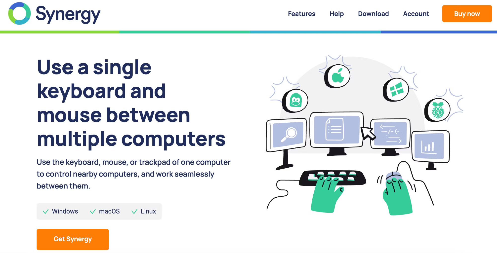
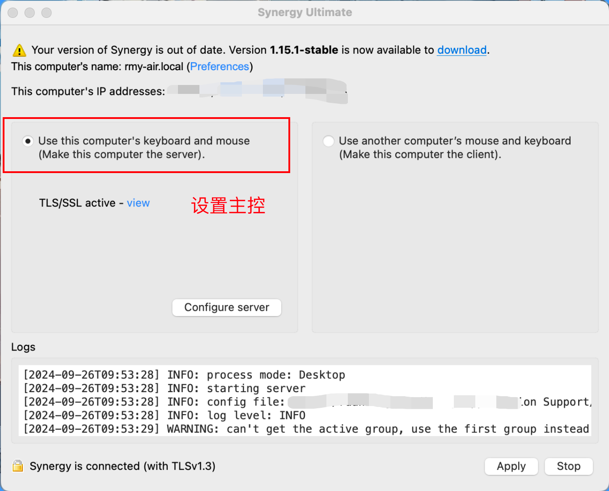
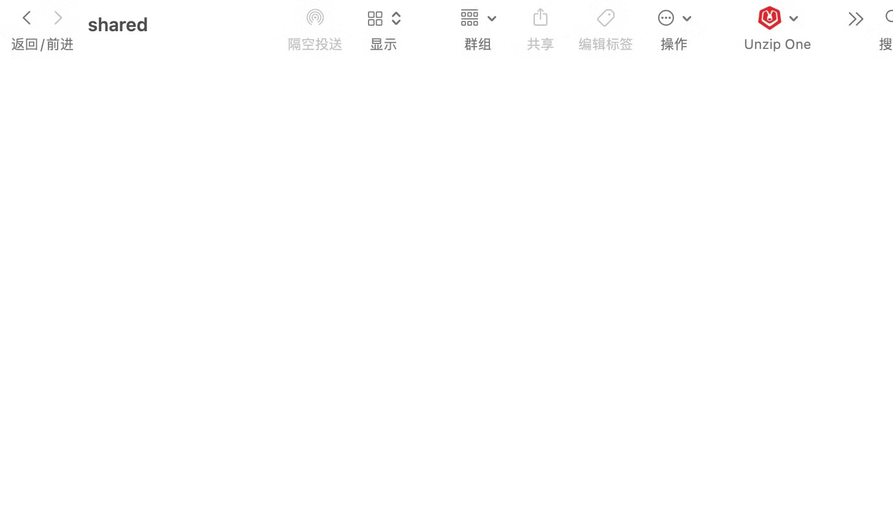

我这边两个电脑一个 mac 一个 win，主要用的 mac，然后 win 做一些测试还有分析数据用。之前的做法都是 mac 外接一个显示器然后去远程 win，放到外接显示器上面，但是这样有个问题就是会浪费我一个外接显示器。

# 一、*Synergy* 解决控制问题

1. 我开始查就想怎么在 mac 上面直接去控制 win 的界面，然后就查到了这个 *Synergy。它*可以实现一套键鼠控制两个系统。

   
2. 接着又去b 站搜到了一个 up 主的破解教程，里面也有 up 主做好的可以直接下载，感兴趣的大家可以试试。

   [Synergy编译、去激活、汉化：macOS+Windows保姆级教程](https://www.bilibili.com/read/cv19053031/)
3. 先在两个 pc 下载好软件（两个 pc 处于同一个局域网下），在 mac 上面设置为主机，win 上面设置为被控端，然后填写好主机地址，做完这些两边 apply以后就可以 start 了。这样就可以通过 mac 的键鼠来操作 win 的界面了，并且能共用剪切板。

   

   

> 小小吐槽一点，在 win 上面出现一些系统告警弹窗时（比如卸载软件），这种时候无法通过 synergy 去控制。还是有点麻烦的，这个目前没有查到好的解决办法

# 二、SMB 解决文件共享问题

1. 在 mac上面我收到一些文件，如果要通过 win 去打开，在远程桌面的状态下，是可以直接在 mac 上面拷贝，在 win 上面粘贴，就会把文件传输过去。但是用 synergy的话就不能复制粘贴了，如果这个时候拿一个 u 盘作为中间过渡，个人觉得太麻烦了pass；
   还有一种就是有一些通过 http 的局域网文件传输的方案，比如pairdrop在浏览器中找到对方并发送文件或者 fileShare类似启动一个 web server，让其他人通过浏览器来下载的。这些都需要打开浏览器，并且都输入单向的传输，并且每次都要特意去打开这些服务，还是不太 ok
2. 然后就想到了通过 SMB 文件夹共享的方式，在 win 的桌面上面创建一个文件夹，然后选中，右键属性，选择共享，然后开启共享还有高级共享，注意其中权限部分设置为“完全控制”。查一下 win 的 ip 地址。

   
3. 然后在 mac 桌面状态，按 common+k，打开这个连接到服务器，输入 smb://win的ip/shared
   (images/image%203.png)
4. 输入完成以后，点击连接会要求输入账号密码，这些选择“注册用户”，然后注意这里的坑，
   如果直接输入 win 的用户名和密码，会出现窗口抖动一下就没反应了（我的 mac 是 14 版本），我试过了另一个 windows 连接这个就正常。

   

   先说结论：**在用户名前面加一个反斜杠**

   排查过程见文末
5. 连接好以后就可以在 mac 里面看到这个文件夹，可以给他固定到侧边栏，这样就方便打开，后面有需要放到 win 上面打开的文件，就直接在 mac 上面复制到这个文件夹，这样再去操作 win 的时候就有这个文件了。

   

   

   # 三、SMB故障

   这里坑了我好久，网上说这个问题是系统 bug还有什么重启 windows 能解决的都试过不行

   

   最后自己抓包查了下，一抓就发现不对劲了，这里的“11”是我输入的用户名，但是前面的部分怎么回事？这个确实不是我输入的，但是因为这个的存在，导致 win 这边接收到的用户名就不对了，然后回包 STATUS_NO_LOGON_SERVERS。

   

   没想明白这个前缀从哪来的，但是按照他的格式，我尝试了下主动去输入这个名字，试了两次，到了”/11”的时候成功了！再抓包一看，果然**在用户名前面加一个反斜杠**，mac 这边发的包里面就没有了这个前缀，对上了！
