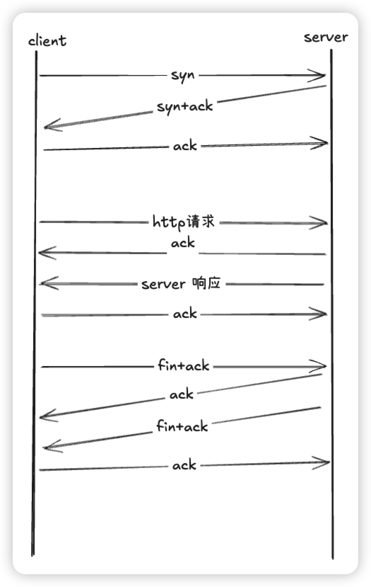

## tcpdump

> tcpdump是一个命令行界面的网络协议分析器，可以在类Unix系统上使用。它让用户能够捕获和分析通过网络的数据包。

### 1.1 常用的命令

```bash
tcpdump -i ens160  host 192.168.1.10 and port 80 and tcp -c 100  -w /var/tmp/capture.pcap -vvv
```

命令分析(以下命令注意区分大小写！)

```bash
-i 指定需要捕获的网卡，具体网卡名通过***ip a*** 命令进行查看，也可以用 ***any*** 代表所有网卡；
host 指定主机地址，这里可以是源地址或目的地址，如果想要限定源地址就用 ***src.host ,***如果想要限定目的地址就用 ***dst.host***；
and 指定前后关系，有 ***and***、***or***、***not***以及‘***（）***表示分组‘这几种关系；
port 指定端口号，这里可以是源端口或目的端口，如果想要限定源端口就用 ***src.port ,***如果想要限定目的地址就用 ***dst.port***；
tcp 指定捕获 tcp 类型的数据包，还可以是 ***udp***、***icmp*** 、***arp***；
-c 指定捕获包的数量，达到这个数量就停止；
-w 指定存储位置而不是直接显示在终端上面，一般文件名以.pcap结尾；
-vvv 输出的是超详细模式，一般用这个；另外还有***-v***和***-vv***；
```

补充一个**循环抓包**

```bash
noup tcpdump -i ens160 -w /var/tmp/capture.pcap -W 10 -C 50 &

-W 指定循环的数量，达到指定数量以后就开始从前往后覆盖；
-C 指定每个包的大小，达到指定大小就开始生成下一个包（单位是M）；
nohup xxx & 后台运行不进行输出记录；
```

## wireshark

> wireshark是一个广泛使用的开源网络协议分析工具，可以捕获、分析并展示网络流量，帮助网络管理员、开发者和安全专家深入理解网络协议的行为，诊断网络问题，分析网络攻击等。

[**官方下载地址](https://www.wireshark.org/download.html)，**下载以后直接安装进行不用勾选其他的；

### 2.1 tcp 的传输过程

一般针对的就是 tcp 的数据包进行分析，分析之前呢需要先简单了解下 tcp 的传输过程以及 http 数据包的发送过程；

---

**TCP的三次握手**

1. 第一次握手：

   客户端向服务器发送一个SYN（同步序列编号）标志的数据包，表示客户端请求建立连接。
2. 第二次握手：

   服务器收到SYN包后，会回应一个SYN-ACK（同步确认）包，表示服务器的SYN标志，并确认客户端的SYN。
3. 第三次握手：

   客户端收到服务器的SYN-ACK包后，会发送一个ACK（确认）包，表示客户端的ACK标志，确认服务器的SYN。至此，三次握手完成，连接建立成功。

**HTTP请求和数据传输**

在TCP连接建立后，客户端会发送HTTP请求，服务器响应请求并返回数据。

1. HTTP请求

   客户端向服务器发送HTTP请求，例如GET请求获取网页内容。

   示例：GET /index.html HTTP/1.1
2. 数据传输：

   服务器收到请求后，处理请求并返回响应数据，例如HTML文件。

**TCP的四次挥手**

1. 第一次挥手：

   客户端发送一个FIN（结束）标志的数据包，表示客户端请求关闭连接。
2. 第二次挥手：

   服务器收到FIN包后，会回应一个ACK包，表示服务器的ACK标志，确认客户端的FIN。
3. 第三次挥手：

   服务器在发送完所有数据后，也会发送一个FIN包，表示服务器请求关闭连接。
4. 第四次挥手：

   客户端收到服务器的FIN包后，会回应一个ACK包，表示客户端的ACK标志，确认服务器的FIN。至此，四次挥手完成，连接关闭。

   

如果是 https 数据包（https 数据包无法直接查看应用层数据），还有证书协商的过程具体如，下：

1. Client Hello：

   客户端向服务器发送一个Client Hello消息，其中包含客户端支持的加密套件列表、随机数（Client Random）、会话ID（Session ID，如果客户端希望恢复之前的会话）等信息。
2. Server Hello：

   服务器收到Client Hello后，选择一个加密套件（从客户端提供的列表中选择），并生成一个随机数（Server Random）。
   服务器向客户端发送一个Server Hello消息，其中包含选择的加密套件、Server Random、会话ID（如果服务器希望恢复之前的会话）等信息。
   如果服务器需要客户端进行身份验证，还会发送一个Certificate Request消息。
   服务器发送自己的证书链（包括服务器证书和任何中间证书），以便客户端验证服务器的身份。

   证书验证：

   客户端收到服务器的证书后，使用CA（证书颁发机构）的公钥解密证书中的数字签名，得到数字摘要。
   客户端使用与证书中相同的摘要算法对证书进行摘要操作，得到另一个数字摘要。
   客户端比较两个数字摘要，如果相同，则证书验证成功，确认服务器的身份是真实的。

   密钥交换和加密：

   如果服务器选择的加密套件使用RSA进行密钥交换，客户端会生成一个Pre-Master Secret（预主密钥），并使用服务器的公钥进行加密，然后发送给服务器。
   服务器使用自己的私钥解密Pre-Master Secret，得到原始的Pre-Master Secret。
   客户端和服务器都使用Pre-Master Secret、Client Random和Server Random作为输入，通过一定的算法生成一个对称密钥（会话密钥）。
   如果加密套件使用DH（Diffie-Hellman）或其他密钥交换算法，密钥交换的过程会有所不同，但最终目的是生成一个对称密钥。

   Change Cipher Spec和Finished：

   客户端和服务器都使用生成的对称密钥进行加密通信。
   客户端和服务器分别发送一个Change Cipher Spec消息，通知对方自己将开始使用新的加密密钥进行通信。
   客户端和服务器分别发送一个Finished消息，该消息包含之前所有握手消息的摘要，并使用对称密钥进行加密。
   双方验证Finished消息的正确性，如果正确，则HTTPS通信建立成功。

---

### 2.2  数据包分析过程

1. 打开数据包，界面如下

   
2. 然后根据我们确定的内容，比如http请求的 url 或者源端口，一般语法
   `http.request.uri ="请求的 url" tcp.srcport==源端口`
3. 锁定到具体行以后，右键-追踪流-tcp stream就能找到相关的数据流了，接着分析相关的过程是否完整（操照上一步的tcp 数据流的过程），根据现象逐步判断；

   

   
4. 补充常用的语法

   ```bash
    tcp.flags.reset==1  过滤 rst 包
    tcp 过滤 tcp数据包
    http 过滤 http 数据包
    ip.addr==指定ip  过滤指定ip的数据包
    && 且
    || 或
    != 非
   ```
