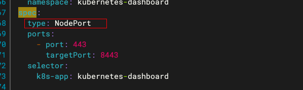

# 一、安装 dashboard

1.在 master 上安装dashboard(拉取失败的话可以下载附件传到服务器)

```bash
wget  https://raw.githubusercontent.com/kubernetes/dashboard/v2.0.0-rc7/aio/deploy/recommended.yaml
```

[recommended.yaml](images/recommended.yaml)

2.修改配置文件，用 NodePort 模式方便等会页面访问

```bash
vi recommended.yaml 
```



3.创建dashboard服务，检查是否正常启动

```bash
kubectl apply -f  recommended.yaml 

kubectl get all -n kubernetes-dashboard  -o wide
```


> 可以看到目前dashboard运行在 node2 上，外部访问的 ip 是 31014，等会访问 https://node2:31014/

4.接着创建用户分配权限

```bash
kubectl create serviceaccount  dashboard-admin -n kube-system

kubectl create clusterrolebinding  dashboard-admin --clusterrole=cluster-admin --serviceaccount=kube-system:dashboard-admin

kubectl describe secrets -n kube-system $(kubectl -n kube-system get secret | awk '/dashboard-admin/{print $1}')
```


保存 token

5.通过浏览器 https://node2:31014/，。（如果浏览器提示不安全无法直接访问，点击页面输入 thisisunsafe即可）


6.输入 token 进入控制台


7.快捷生成 token

```bash
kubeadm token create --print-join-command
```

至此dashboard安装完毕！

# 二、使用dashboard启动一个 nginx


编辑 svc/ingress，将type 由‘LoadBalancer’改成‘NodePort’ ；就可以外部访问


